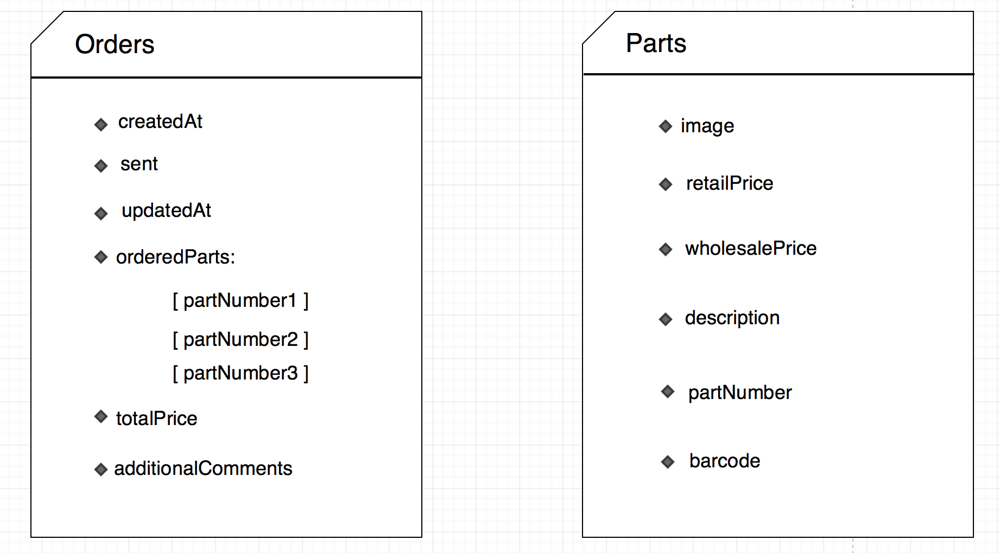

# PARTS ORDERING FOR BACK2BIKES

## 1. Who is your client?

back2bikes is a social enterprise, providing bicycle training, repair and recycling services for the local community, asylum seekers and refugees.

back2bikes is run by volunteers, and is supported by Port Phillip Council.

They are looking for:

* New volunteer mechanics (no skills required)
* New volunteers to promote them
* Donations of usable bikes and parts
* Bike servicing

They offer:

* Quality secondhand bikes for sales
* Cheap servicing and parts
* (Paid) Maintenance courses
* Free training for volunteers
* Bikes for refugees and asylum seekers

We are happy to be involved with an organisation that helps the community and is not for profit.

## 2. What is your client’s need (i.e. challenge) that you will be addressing in your project?

Back2bikes buy all of their parts from one supplier, Bicycle Parts Wholesale who do not provide RRP (Recommended Retail Price) to them.
At present they can't hide the trade price from the customer when looking at their web site. 

http://www.bicyclepartswholesale.com.au/page/10/product-catalogues

Bicycle Parts Wholesale (BPW) publish a glossy colour catalogue, which is essential when placing orders, as the photos on the web site and the descriptions are not always adequate to work out which part to order. After finding the part number in the cataloguer, the manager accesses the BPW website to get the price for the customer which is not published in the catalogue. Even though the price on the website might say $10 - it is the wholesale price and does not include things like gst, delivery, and profit to pay the employed staff. (Most are volunteers at back2bikes but the manager is employed by them.)

 It is often a timeconsuming and awkward process telling a customer a much higher price than the wholesale price they can see on the screen. back2bikes hope that we can come up with a solution to this problem over the three weeks of this project.

## 3. Describe the client’s current setup and data.

React JS
Used in the front-end. This front-end framework will allow us to segregate all of our on-screen components letting us combine them into a well-designed UI for the user. Manipulation of component props and state will be updated in real-time so load times are much less.

MongoDB
Used as the Database. Mike from Back2bikes has already set up his existing web-app with mongo and for consistency we will do the same. MongoDB is a table-less database and stores data in JSON-like documents.

Meteor
A full-stack javascript platform. It includes different libraries for building connected-client reactive applications. It allows us to develop in javascript across all environments, i.e. application server and web-browser.

Semantic UI
A modern front-end development framework that provides a sleek, subtle, and flat design look that provides a lightweight user experience. It uses minimal and neutral styling which allows ample room for customization.

Story Book
A development environment for UI components. It Helps visualize the states of UI components and develop them interactively. Storybook runs independantly, it is does not have specific dependancies and requirements.

Docker
A containerize platform that is designed to make it easier to create,deploy and run applications. By packaging up the parts needed such as libraries and other dependancies which is then deploys everything as one container.


## 4. Describe the project will you be conducting and how your App will address the client’s needs.

back2bikes buy all their bicycle parts from one particular supplier - Bicycle Wholesale Australia.

The solution to the problem identified in question 2 is to create a full stack application that will pull the data from the supplier and render it on Back2Bikes own app in workshop. This way mechanics/volunteers can follow their known sale/consulting process with improving on margins that come from parts sales.

The application will allow for searching via part number (volunteers use in house, pysical catalogue for parts' number), name and description.

The solution includes creating a backend that will organise the data from the supplier and algorythms for rendering RRP on the frontend.

back2bikes have a XLSX file of the suppliers database. It is simply a list of parts with a part number, a short description, a barcode and wholesale price. No category or sub-category information is available.

To solve this problem we need to do the following:

* Import the parts list and prices to our (Mongo) database
* Provide a simple page (within their existing Meteor app) to allow searching of the database, either by name or part number
* Write an algorithm to calculate a RRP
* Display the price of the part(s) found as a list
* Provide an advanced search option
* Integrate this solution into their current app

All to be done using React, Storybook, TDD

### Possible extension: 

* Allow part to be added to a draft order, with a quantity
* Review draft order, add/remove parts
* Send order to supplier (via email)

### Pricing algorithm

* The first calculation is to double the wholesale price to make RRP. 
* This helps to cover GST and shipping costs.
* Anything over $60, the margin is 50%
* Anything over $100 the margin is 30%

## 5. Identify and describe the software (including databases) to be used in your App.

### Visual Studio Code
  * Visual Studio Code is a source code editor. It includes support for debugging, embedded Git control, syntax highlighting, intelligent code completion, snippets, and code refactoring. This is our standard text editor, but some may opt to not use it.

### Storybook
  * Storybook is a development environment for UI components. It allows you to browse a component library, view the different states of each component, and interactively develop and test components. We will be using this throughout our testing phases before pushed to production.

### Figma
  * Our standard for designing and will be used to create our wireframes. Figma is a free software that makes wireframing very easy with the ability to create components and reuse them in our design however we like.

### Nuclino
  * Nuclino is a cloud-based team collaboration software which allows teams to collaborate and share information in real-time. We will be using this to share information that will stay the same throughout the length of the project, such as coding standards and git workflow practices.

### Trello
  * Trello is a collaboration tool that organizes your projects into boards. In one glance, Trello tells you what's being worked on, who's working on what, and where something is in a process. We will be using this throughout the project to track who is working on what and what is being worked on, so there is no overlap.

### MongoDB
  * MongoDB is the database used in our application. Our client already uses this so we will continue to do the same for consistency.

## 6. Identify and describe the network setup you will use in your development.

Our application will be deployed on Heroku and client's hosting server.

Previously the attendance application has been hosted on a local server. The benefits of choosing this path would be environmental control and increased security. However, we felt that hosting on Heroku made it easy for both tech admins and user alike.

We did not have to use Amazon Web Services due to the fact that our assets are already dynamically added via url address, taken directly from parts supplier website.

## 7. Identify and describe the infrastructure (i.e. hardware) that your App will run on.

Even though our app will be deployed online, it will primarily be accessed from just one computer in the back2bikes workspace. The App will not be hosted on a local server but deployed to the cloud. 

The app will exist online, hosted by the back2bikes current site. They already run an attendance web app that the volunteers use to sign in and out when they are in attendance. Our app will integrate into this seamlessly.

## 8. Describe the architecture of your App.

The architecture of our app consists of a front-end and a backend.

### Back-end

In the backend we are using MongoDB Database. Although MongoDB is schema-less database and is document orientated, it is good practice to constrain the contents of the collections to conform to a known format.

That way we do not need to write defensive code to check and confirm the structure of the data as it comes out of the database, instead of when it goes into the database. The logic behind creating a schema in a document-orientated database is because we tend to read data more often you write it.

### Front-end

We are using React on the front end to render components on the client side. We use Minimongo library which creates a local cache in the front-end allowing us make live-updating database queries.

### App Architecture

Meteor initialises code from the Client and Server directory. Both Client and Server will point to the configuration files in the startup directory and load all the code.

The app's main architecture is made up client, server and imports.
```
server/
client/
imports/
  startup/ 
        server/ 
        client/
    api/ 
    ui/
 ``` 

 

### Deployment

The app will be deployed on Heroku. All builds and releases will be managed on Heroku.

## 9. Explain the different high-level components (abstractions) in your App.

The application will consist of backend which will pull the data from the supplier and serve it to the Meteor's Frontend.

Front-end will consist of:
    
    1. COMPONENT: List of parts (name, part number, description, image ... )
        
        i. COMPONENT: A card with for each individual part


    2. COMPONENT: Search bar

        i. COMPONENT: input field

        ii. COMPONENT: advanced filtering options

## 10. Detail any third party services that your App will use.

There are no direct or obvious third party services used. However we are using:

* React by Facebook - a Javascript library for building user interfaces.

* Heroku ( Deployment ) - a cloud platform hosting service that supports numerous programming languages.

## 11. Identify the database to be used in your app and provide a justification for your choice.

MongoDB is the database used in our application. Our client already uses this so we will continue to do the same for consistency.

Using a MongoDB data model lets us represent hierachical relationships, data arrays and other complex structures we may need to take advantage of during development.

## 12. 

## 13. Provide your database schema design

Our database will consist of two schemas. One for orders and one for parts. Orders will contain what is in the order and other order information while the parts schema will consist of the details and information about each part.



## 14. Provide User stories for your App.

### Volunteer Stories

- As a bike mechanic, I need to be able to order parts quickly and easily so I have more time to fix bikes and help others learn to fix bikes

- As a unemployed cycling lover I like to volunteer at back2bikes to learn to fix bikes so that I can improve my skills and help the community. I get left alone while parts get ordered on our slow computer when I'd rather have help

### Shop Manager

- As an experienced manager I don't want my process to change too much so I can continue building relationships with customers

- As an experienced manager I dislike our slow ordering process, accessing a slow website on a slow computer as it takes too much time out of my day

- As an experienced manager I find it difficult to explain the price we charge to customers as they can see the wholesale price when we are putting an order through

- As a shop manager, I would like to save parts that need to be ordered throughout a day everyday so I can confirm the order with the wholesaler only once or twice a week at max

- As a shop Manager, I would like to review the order before I confirm it, so I can amend quantity and be able to remove items if they are not needed anymore

- As a shop manager, I would like to be able to quickly distinguish whether I am on searching parts page or reviewing order list so I don't waste my time looking for a parts in the wrong place

- As a shop manager I would like to be able to see the total wholesale price for the order, so that I can see if I am within spending budget

- As a new assistant manager I would like to quickly search for an item using item number and add it to shop ordering cart, so I don't forget to order it later

### back2bikes Owner

- As the owner of the business, I would like to be able to see both the net price and wholesale price within the ordering system, so money in and out can be tracked easily

- As a business we need to earn money to pay our employed manager and cover costs such as delivery and gst so we can continue to survive and grow

### Customer

- As a bike rider I enjoy the quality and friendliness of the back2bikes volunteers but feel like their ordering system is slow and confusing

- As an owner of many bikes I like to get my bikes fixed quickly and cheaply. I get confused when I see on the back2bikes ordering website that a price is $30 but they charge me $60

- As a customer, I would like to see the final price that it will cost me to fix/service my bicycle so I don't have to do any additional calculations myself

- As a customer I like transparent costing so I don't encounter any hidden costs later on

## 15. Provide wireframes for your app.


## 16. Describe the way Tasks are being allocated and tracked in your project.

### Agile
Agile methodology is used in many software development environments, we have stand ups every morning and record them into our trello board. 

#### Trello 
We use Trello, a project management tool to allocate and track key milestones in our project and Nuclino, a workflow management tool.

### Internal Team Trello Board
- Tasks filled on cards are required for planning phase.
- List down all tasks that needs to be completed.
- Use trello color labels to allocate task to each team member.
- Dedicated columns (swim lanes) for completed tasks.
- Summaries of Agile standups.


### Back2Bikes (Client) Trello Board
- Collaborative board with client.
- Consist of tasks of the development phase. 
- Tasks include features that are inspired from user stories and user pains.
- Columns (swin lanes): Backlog, Ready, In-progress, Dev Done, QA, Done


## Nuclino
Each member should reflect, track and manage the workflow to ensure that we are maintaining consistency with the standards provided by the client. Using all the dev tools will be important for collaboration and achieving efficiency.

Standards
* Filenaming
* Component names
* Collection names
* Coding style

Workflow
* Git
* Test Driven Development
* Agile
* Trello Board
* Git - Branching strategy


## 17. Discuss how Agile methodology is being implemented in your App.

We will work as an agile team. This means:

* Sprints (1 week)
* Aim for Minimal Viable Product (MVP)
* From the Agile Manifesto:
  * Working code over documentation
  * Individuals and Interactions Over Processes and Tools
  * Customer Collaboration Over Contract Negotiation
  * Responding to Change Over Following a Plan

Other agile gems:

* Frequent delivery of working software 
* Fail quickly (or don't be afraid to fail and change course)

How do we do this?

* Use Trello as our Kanban board for the sprint
* Work on one thing at a time
* Talk about what it is, and how to do it
* Challenge the story

## 18. Provide an overview and description of your Source control process

### Git branching strategy:

- master

The master branch corresponds to the code that is currently in production. Every time we do a deployment to production, we put a tag in git, so that we have a way to go back to a particular release (in case we ever need to). This branch is protected to prevent accidental updates

- develop

The develop branch corresponds to the code that is currently on the staging server. Similarly these versions are tagged in git when we deploy them, and the branch is also protected.

- feature/xxx branches

Feature branches are for developing particular features, for example a feature to add a part to an order might be named feature/order-add-part. 

All branches should be created from develop.  You should never create a branch from another , unless there is a dependency on code in that branch.

- fix/xxx branches

If you are making changes to address a bug that is not urgent, you should use a branch name like fix/xxx. This change will go through the regular release workflow just like feature changes.

- hotfix/xxx branches

If you are making changes to address a bug that is urgent, and needs to be installed without delay, then you can use the hotfix prefix. The branch should be created from the master branch, as it will be merge directly into master, and deployed from there. This workflow is unusual, and does not follow the regular release procedure. It should be limited to small changes, to minimise the risk of failure.

## 19. Provide an overview and description of your Testing process.

Test Driven Development (TDD) is essential. We write tests first. Testing can (and should be) done manually.

Writing tests means the need for manual testing reduces (but never disappears completely).

We consider testing a bit like designing before you start coding. The test is like the design or even a 'definition of done'.

Once you have written some code, the test starts to be useful, because while it is failing, it tells you that you are not finished yet.

We write immutable (or stateless) code that is easier to test.

Write small components that do well defined things. It makes testing more powerful and useful. Complex components are a lot harder to test for which exposes you to unpredictable bugs in the future.

We use Jest for testing as well write stories using Storybook which covers a lot of testing as well.

## 20. Discuss and analyse requirements related to information system security.

The requirements related to the information system security hinge upon our clients existing security protocols.

The existing software used by the client does not currently require many security features due to the fact that the client does not handle any sensitive data. In saying that, we have been aware of industry standards related to security. This includes not pushing vulnerable data to github (environment variables), using secure messaging services, and respecting our clients privacy requests.

## 21. Discuss methods you will use to protect information and data.

Firstly we are using environment variables to store our keys securely. Any sensitive data(supplier parts details) has not been included in the project on Github to make sure this information is not misused. Any members/volunteers are already using seceret pin number to check in for days work.

## 22. Research what your legal obligations are in relation to handling user data.

The GDPR is the most official guidelines regarding handling of personal information. The GDPR states: if we are to store personal data we are to disclose the fact that we are doing so, or not do so at all. No personal data may be processed unless it is done under a lawful basis. Users of the application may request a copy of the personal information collected in a common format, and may have the right to delete any data upon request.

Because we are only creating an application based on making orders and will only be used by staff of the company, we will not have to worry about the GDPR guidelines. We are also not collecting or storing any personal information through our app.

***
